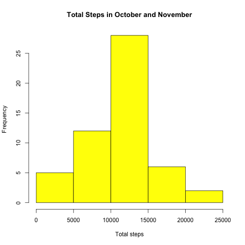
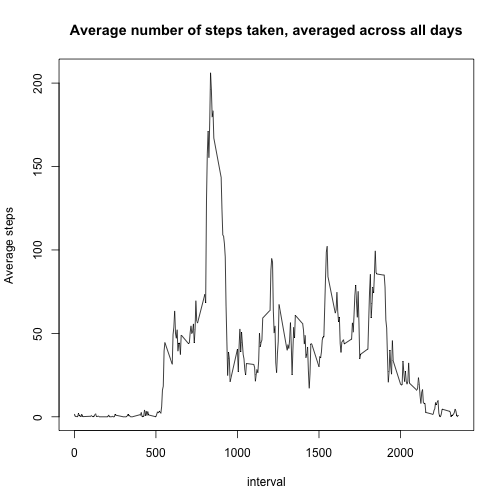
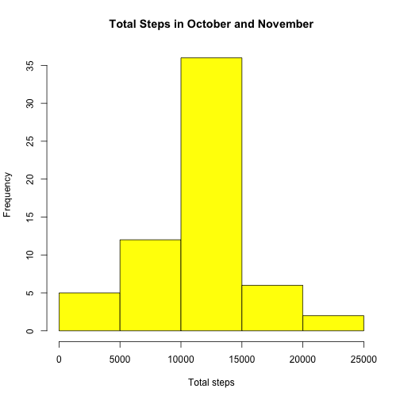
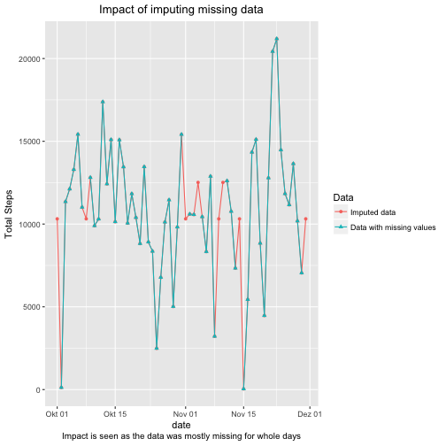
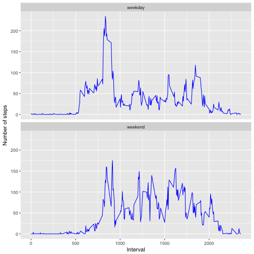

This report analyses the data from a personal activity monitoring device. This device collects data at 5 minute intervals through out the day. The data consists of two months of data from an anonymous individual collected during the months of October and November, 2012 and include the number of steps taken in 5 minute intervals each day.

## Loading and preprocessing the data
First of all we load the activit.csv using *read_csv* from the **readr** package. Next we create a data frame without any missing values. 

```r
require(readr)
require(tidyverse)
activity <- read_csv("activity.csv")
activity_no_na <- activity %>% 
                  filter(!is.na(steps))
```


## What is mean total number of steps taken per day?
In order to find the mean total number of steps taken per day, we group the data frame without the missing values(*activity_no_na*) on date, and then calculate total number of steps in a day. With this data in hand, we use the **base** package to create a histogram. 

```r
activity_grp <- activity_no_na %>% 
                group_by(date) %>% 
                summarise(total.steps = sum(steps))
hist(activity_grp$total.steps, xlab = "Total steps", main="Total Steps in October and November", col="yellow")
```



Next we calculate and print out the mean and median of the total number of steps taken per day.


```r
median_steps <- median(activity_grp$total.steps)
mean_steps <- round(mean(activity_grp$total.steps), 2)
paste("Mean:", mean_steps)
```

```
## [1] "Mean: 10766.19"
```

```r
paste("Median:", median_steps)
```

```
## [1] "Median: 10765"
```


## What is the average daily activity pattern?
Here we'll represent the average daily activity patter in the form of a time-plot. We group the data frame without the missing values on interval,  and then calculate average number of steps in a particular interval. With this data in hand, we use the **base** package to create a time-series plot.  

```r
activity_interval_mean <- activity_no_na %>% 
                          group_by(interval) %>% 
                          summarise(avg.steps.int = mean(steps))
with(activity_interval_mean, plot(interval, avg.steps.int, type="l", ylab = "Average steps", main = "Average number of steps taken, averaged across all days"))
```



Next, we figure out the 5-minute interval, which contains the maximum number of steps, on average across all the days in the dataset.

```r
max_steps <- activity_interval_mean %>% 
             filter(avg.steps.int == max(avg.steps.int)) %>% 
             select(interval)
paste("Maximum number of steps are in the interval:", max_steps)
```

```
## [1] "Maximum number of steps are in the interval: 835"
```


## Imputing missing values
We will impute the missing values based on whether the day of missing value is a weekday or a weekend. If the day is a weekday, we'll impute the missing value of the interval with the mean of that interval in weekdays, and if it is a weekend, with the mean of that interval in weekend. For e.g. missing value of interval 0 on 2012-10-01(a weekday) will be imputed by the mean of values of interval 0 on weekdays.  

To achieve this, we follow the following strategy:

1. Create a data frame that contains mean step values for each weekday and weekend respectively
2. Create a new column, representing if the day is a weekday or a weekend, in the dataframe with the missing values.
3. Merge the two data frames based on interval and whether or not its a weekend
4. Replace the NA values with the average step value

Next we create a histogram of the total number of steps taken each day


```r
require(chron)
total_nas <- sum(is.na(activity$steps))
activity$isWeekend <- is.weekend(activity$date) 
activityWknd <- activity %>% 
                group_by(interval, isWeekend) %>% 
                summarise(avg.steps = ceiling(mean(steps, na.rm=T)))
mrg <- merge(activity, activityWknd, by=c("interval", "isWeekend"))
mrg <- mrg %>% 
       mutate(steps = ifelse(is.na(steps), avg.steps, steps))
activity_mrg<- mrg %>% 
               group_by(date) %>% 
               summarise(total.steps = sum(steps))
hist(activity_mrg$total.steps, xlab = "Total steps", main="Total Steps in October and November", col="yellow")
```



Next we calculate and print out the mean and median of the total number of steps taken per day.


```r
median_steps <- median(activity_mrg$total.steps)
mean_steps <- round(mean(activity_mrg$total.steps), 2)
paste("Mean:", mean_steps)
```

```
## [1] "Mean: 10779.15"
```

```r
paste("Median:", median_steps)
```

```
## [1] "Median: 10571"
```

As we can see, the mean goes up and the median goes down, after we impute the missing values. This behavior is as expected, since we are adding more values.

Now we will compare total steps with and without imputed data


```r
totalStepsComp <- left_join(activity_mrg, activity_grp, by="date") 
tidyComp <- gather(totalStepsComp, "Steps.typ", "Total.Steps", -date)
a <- ggplot(data=tidyComp, aes(x=date, y=Total.Steps, group=Steps.typ, shape=Steps.typ, color=Steps.typ)) + 
        geom_line() + 
        geom_point()
a + scale_color_discrete(name="Data", labels=c("Imputed data", "Data with missing values")) + 
    scale_shape_discrete(name="Data", labels=c("Imputed data", "Data with missing values")) + 
    labs(y="Total Steps", 
         title="Impact of imputing missing data",
         caption="Impact is seen as the data was mostly missing for whole days")   + 
    theme(plot.title = element_text(hjust = 0.5), plot.caption = element_text(hjust=0.5))
```



Here we see that imputing data brings in values for days which were missing earlier. All in all, total number of steps doesn't change for most dates.


## Are there differences in activity patterns between weekdays and weekends?
Mostly, everybody performs different activities depending on weekday or weekend. Here we try to analyze that behavior.


```r
wkendComp <- mrg %>% 
             mutate(isWeekend = ifelse(isWeekend, "weekend", "weekday"))
new_activity_interval_mean <- wkendComp %>% 
                              group_by(interval, isWeekend) %>% 
                              summarise(avg.steps.int = mean(steps))
ggplot(new_activity_interval_mean, aes(interval, avg.steps.int)) + geom_line(color = "blue") + facet_wrap(~isWeekend, ncol = 1) + labs(y="Number of steps", x="Interval")
```



As clearly visible, there are considerable differences in the activity performed on a weekday and a weekend.
